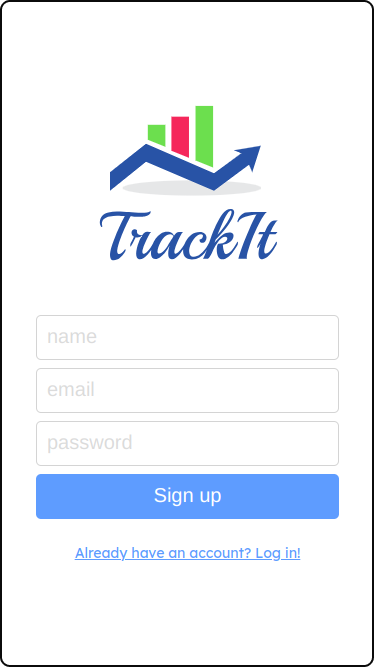
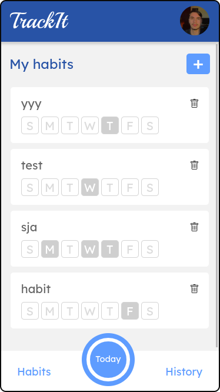
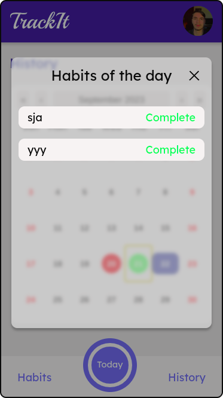

# English version 🇱🇷 - [(Go to Brazilian version 🇧🇷)](https://github.com/GuiCintra27/Track-it/blob/main/readme-portuguese.md)

An mobile app to create and track habits!

### Sign In / Sign Up

   
  

### Home

   
   
  

### Today Habits

  
  

### History

  
  

### User Settings

  
  

### Theme and Languages

  
  

Try it out now at: https://track--it.vercel.app/

[Figma of the project](<https://www.figma.com/file/bSwetaNMPrtYkYj3y68hHk/TrackIt-(Copy)?type=design&node-id=0%3A1&mode=design&t=gKE3s5eyBA53pevq-1>)

## About the project

This project aims to help people create and monitor their habits. Being able to manage whether they fulfilled a habit on a given day. In addition to being able to see your habit history, and monitor the development of a new habit!

The application has light and dark themes, and language change (the default language of the site is the one configured in the user's browser)

Below is a list of some of the implemented features:

- LogIn/Register
- Local Storage for data persistence
- Redux for sharing data between components
- Zod and Hook Form for form manipulation
- React Query for asynchronous data management and API communication
- Data caching and controlled cache invalidation
- Changing the theme from css variables
- Change language using i18n
- Use of axios instances
- Design Patterns
- Architecture Patterns

## Technologies

The following tools and frameworks were used in the construction of the project:  

 
  
  
  
  
  
  
    
  

