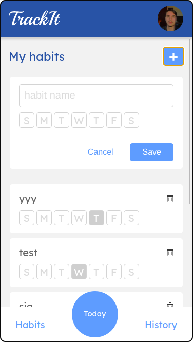
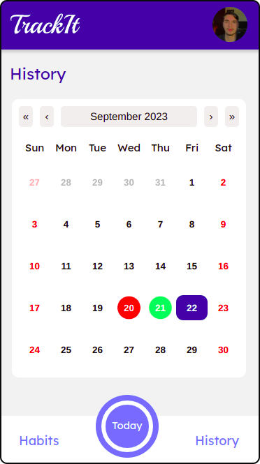
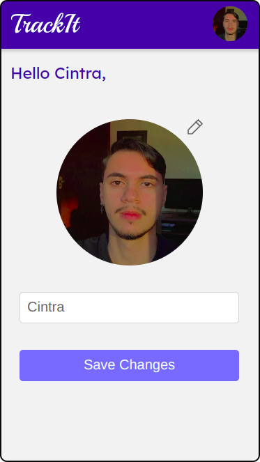
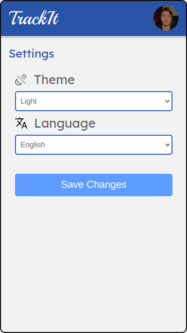
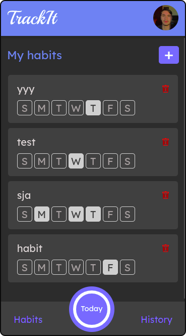
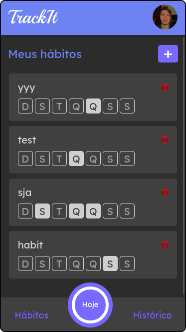

# Versão brasileira 🇧🇷

Um app mobile para criar e acompanhar hábitos!

### Entrar / Cadastro

   
  

### Página Inicial

   
   
  

### Hábitos do dia

  
  

### Histórico

  
  

### Configurações do usuário

  
  

### Tema e Linguagens

  
  

Disponível em: https://track--it.vercel.app/

[Figma do projeto](<https://www.figma.com/file/bSwetaNMPrtYkYj3y68hHk/TrackIt-(Copy)?type=design&node-id=0%3A1&mode=design&t=gKE3s5eyBA53pevq-1>)

## Sobre o Projeto

Este projeto visa auxiliar as pessoas a criarem e acompanharem seus hábitos. Podendo gerenciar se cumpriram, ou não, um hábito em determinado dia. Além de poder ver seu histórico de hábitos, e monitorar o desenvolvimento de um novo hábito!

A aplicação conta com temas claro e escuro, e mudança de linguagem (a linguagem padrão do site é a configurada no navegador do usuário)

Abaixo segue a lista de algumas das funcionalidades implementadas:

- Entrada/Cadastro
- Local Storage para persistência dos dados
- Redux para compartilhamento dos dados entre componentes
- Zod e Hook Form para manipulação de formulário
- React Query para gerenciamento de dados assíncronos e comunicação com API
- Cacheamento de dados e invalidação de cache controlada
- Mudança de tema a partir de variáveis css
- Mudança de idioma utilizando i18n
- Utilização de instâncias do axios
- Design Patterns
- Arquitechture Patterns

## Tecnologias

Abaixo seguem as ferramentas e frameworks utilizados no projeto:  

 
  
  
  
  
  
  
    
  

